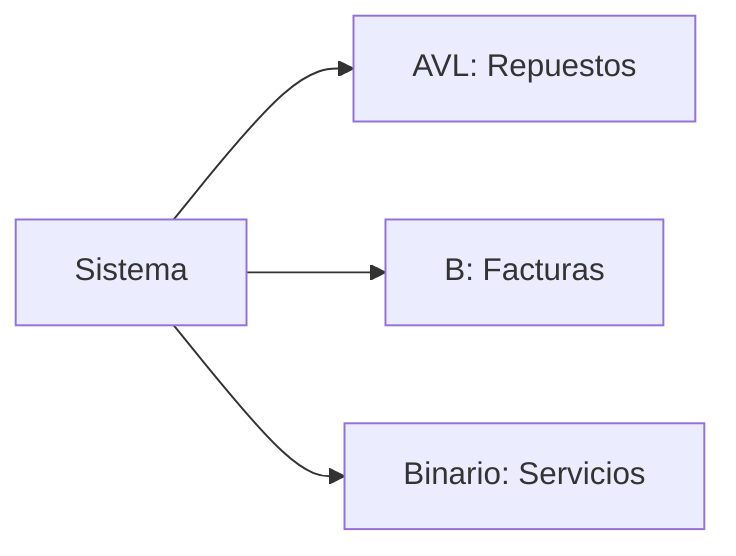
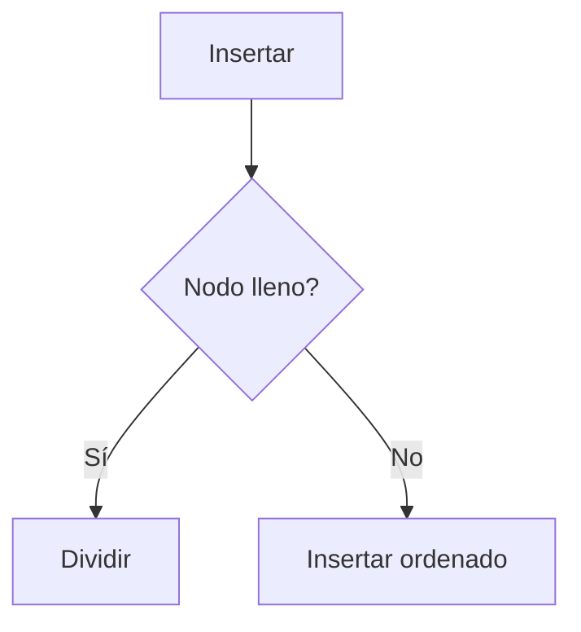
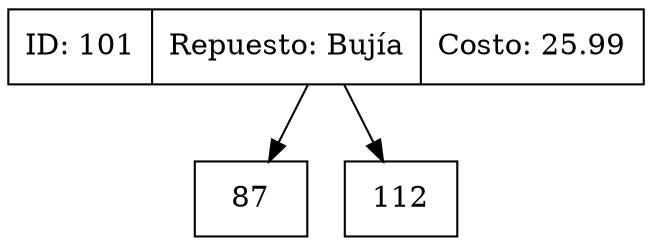
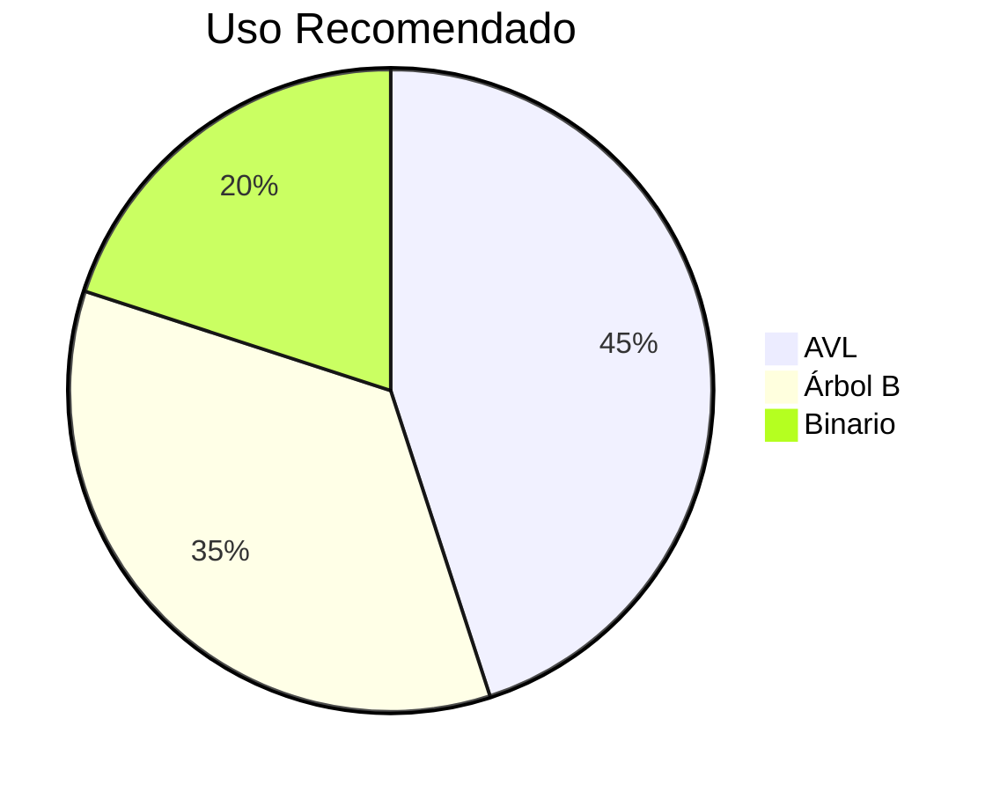

# 🌳 Manual de Desarrollador: Implementación de Estructuras de Árboles

## 📋 Tabla de Contenidos
1. [Introducción](#-introducción)
2. [Árbol AVL](#-árbol-avl)
   - [Estructura](#estructura-avl)
   - [Operaciones clave](#operaciones-clave-avl)
3. [Árbol B](#-árbol-b)
   - [Estructura](#estructura-b)
   - [Operaciones clave](#operaciones-clave-b)
4. [Árbol Binario](#-árbol-binario)
   - [Estructura](#estructura-binaria)
   - [Operaciones clave](#operaciones-clave-binarias)
5. [Visualización](#-visualización)
6. [Benchmarking](#-benchmarking)
7. [Mejores Prácticas](#-mejores-prácticas)

---

## 🌟 Introducción
Implementación de tres estructuras arbóreas en C# para un sistema de gestión automotriz:



---

## 🔄 Árbol AVL

### Estructura AVL
```csharp
public class AVLTree {
    private AVLNode raiz;
    
    class AVLNode {
        public SparePartModel Value;  // Modelo con Id, Name, Details, Cost
        public int Height;
        public AVLNode Left, Right;
    }
}
```

### Operaciones Clave AVL
| Método | Complejidad | Descripción |
|--------|------------|-------------|
| `Insertar()` | O(log n) | Inserta con balanceo automático |
| `RotacionRight()` | O(1) | Balancea el árbol |
| `BuscarPorId()` | O(log n) | Búsqueda eficiente por ID |

**Ejemplo de uso**:
```csharp
var avl = new AVLTree();
avl.Insertar(101, "Bujía", "NGK Platinum", 25.99);
var repuesto = avl.BuscarPorId(101);
```

---

## 📚 Árbol B (Orden 5)

### Estructura B
```csharp
public class BTree {
    private BNode raiz;
    private const int ORDEN = 5;
    
    class BNode {
        public List<BillModel> Claves = new List<BillModel>();
        public List<BNode> Hijos = new List<BNode>();
        public bool EsHoja = true;
    }
}
```

### Operaciones Clave B
| Método | Complejidad | Descripción |
|--------|------------|-------------|
| `Insertar()` | O(log n) | Maneja splits automáticos |
| `DividirHijo()` | O(t) | Divide nodos llenos |
| `Buscar()` | O(log n) | Búsqueda en árbol balanceado |

**Flujo de inserción**:


---

## 🌲 Árbol Binario

### Estructura Binaria
```csharp
public class BinaryTree {
    private BinaryNode raiz;
    
    class BinaryNode {
        public ServiceModel Value;  // Contiene AutomobileId
        public BinaryNode Left, Right;
    }
}
```

### Operaciones Clave Binarias
| Método | Complejidad | Descripción |
|--------|------------|-------------|
| `Insertar()` | O(n) | Inserta según ID |
| `BuscarPorId()` | O(n) | Búsqueda estándar |
| `TablaInOrden_Vehiculos()` | O(n) | Filtra por vehículos |

**Recorridos implementados**:
1. PreOrden
2. InOrden 
3. PostOrden

---

## 📊 Visualización
Todos los árboles implementan:

```csharp
public string GraficarGraphviz() {
    // Genera código DOT para Graphviz
}
```

**Ejemplo de salida**:


---

## ⚡ Benchmarking
| Operación | AVL | Árbol B | Binario |
|----------|-----|--------|---------|
| Insertar | O(log n) | O(log n) | O(n) |
| Buscar | O(log n) | O(log n) | O(n) |
| Memoria | Medio | Alto | Bajo |

---

## 🏆 Mejores Prácticas

**Árbol AVL**
```diff
+ Ideal para repuestos con frecuentes búsquedas
- Evitar para datos que cambian muy frecuentemente
```

**Árbol B**
```diff
+ Perfecto para facturas (grandes volúmenes)
+ Buen rendimiento en disco
```

**Árbol Binario**
```diff
+ Simple para servicios
- Puede desbalancearse con datos ordenados
```

---

## 📝 Conclusión
Elegir estructura según:
1. Volumen de datos
2. Frecuencia de actualización
3. Necesidades de búsqueda

