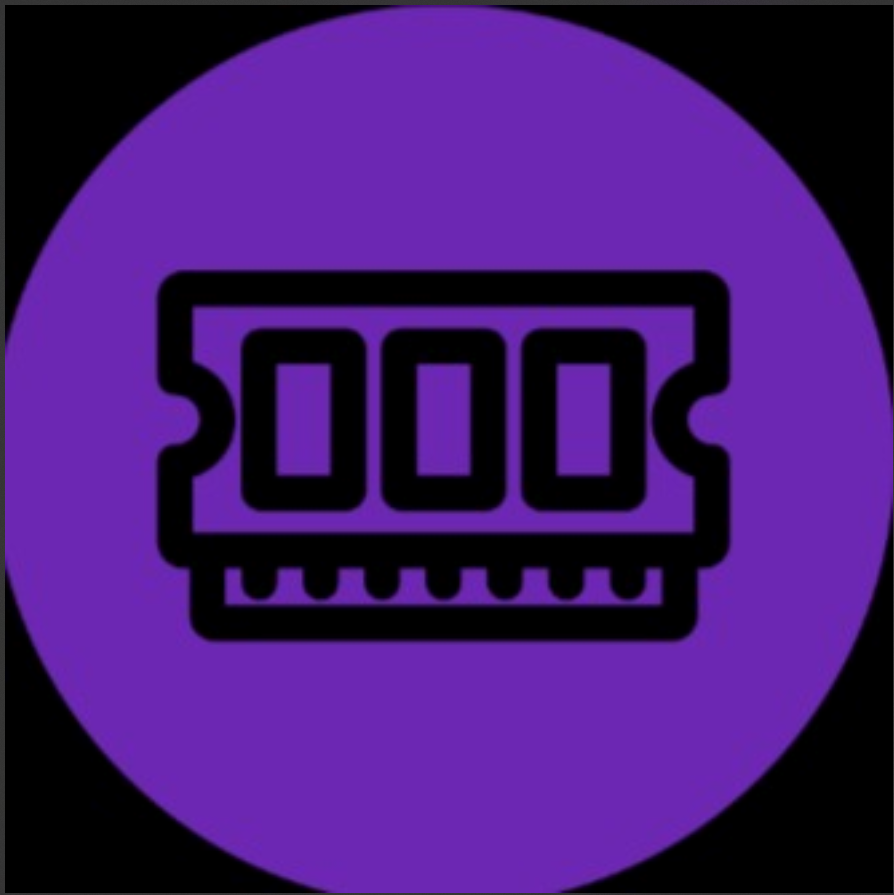
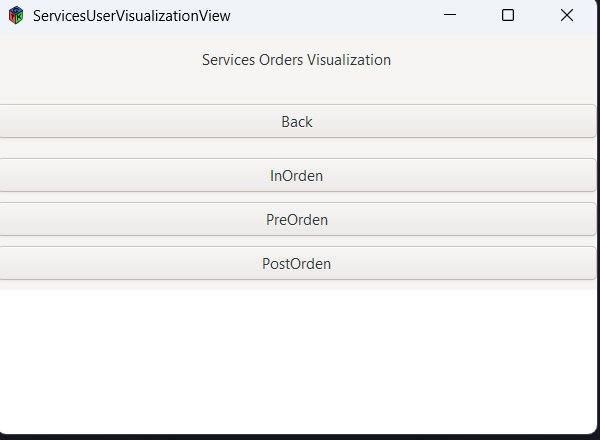
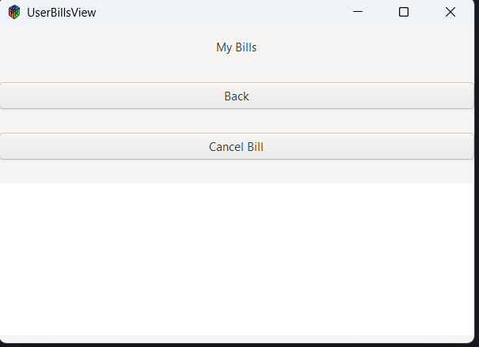

# Manual de Usuario: AUTOGEST PRO
## Sistema de Gestión para Talleres Automotrices

## Tabla de Contenidos
1. [Introducción](#introducción)
2. [Tipos de Usuarios](#tipos-de-usuarios)
3. [Acceso al Sistema](#acceso-al-sistema)
4. [Área de Administración](#área-de-administración)
   - [Dashboard Admin](#dashboard-admin)
   - [Gestión de Usuarios](#gestión-de-usuarios)
   - [Gestión de Repuestos](#gestión-de-repuestos)
   - [Gestión de Automóviles](#gestión-de-automóviles)
   - [Gestión de Servicios](#gestión-de-servicios)
5. [Área de Usuario](#área-de-usuario)
   - [Dashboard Usuario](#dashboard-usuario)
   - [Visualización de Automóviles](#visualización-de-automóviles)
   - [Visualización de Servicios](#visualización-de-servicios)
   - [Gestión de Facturas](#gestión-de-facturas)
6. [Cerrar Sesión](#cerrar-sesión)

---

## Introducción
AUTOGEST PRO es un sistema desarrollado por LabEDD para la gestión integral de talleres automotrices, con dos interfaces diferenciadas:
- **Área de Administración**: Para gestión completa del taller
- **Área de Usuario**: Para clientes del taller

---

## Tipos de Usuarios
| Rol | Accesos |Email|Contraseña|
|------|---------|-------|-------|
| Administrador | Todas las funciones de gestión | admin@usac.com |admin123|
| Usuario | Consulta de sus vehículos, servicios y facturas |-|-|

---

## Acceso al Sistema

1. Ingrese a la aplicación AUTOGEST PRO
2. Complete los campos:
   - **Email**: Su correo registrado
   - **Password**: Su contraseña personal
3. Haga clic en **Validate**

> 🔒 *El sistema redirigirá automáticamente al dashboard correspondiente según su tipo de usuario*

---

# Área de Administración

## Dashboard Admin

Menú principal:
- **Users**: Gestión de cuentas
- **Spare Parts**: Inventario de repuestos
- **Automobiles**: Registro de vehículos
- **Services**: Administración de servicios
- **Session Logs**: Reportes de acceso
- **Logout**: Cerrar sesión

---

## Gestión de Usuarios

1. Funciones disponibles:
   - 📤 **Bulk Upload**: Carga masiva de usuarios
   - 📊 **Show report**: Generar reportes
   - ✏️ **Edit**: Modificar usuarios
   - 🗑️ **Delete**: Eliminar cuentas

2. Campos requeridos:
   - ID único
   - Nombre y Apellido
   - Email válido
   - Contraseña segura

---

## Gestión de Repuestos

1. Acciones disponibles:
   - Agregar nuevos repuestos
   - Actualizar inventario
   - Generar reportes de stock

2. Datos obligatorios:
   - ID del repuesto
   - Nombre descriptivo
   - Detalles técnicos

---

## Gestión de Automóviles

1. Funcionalidades:
   - Registrar nuevos vehículos
   - Asociar a usuarios
   - Actualizar información

2. Campos requeridos:
   - Marca y Modelo
   - Placa/licencia
   - Usuario asignado

---

## Gestión de Servicios

1. Tipos de servicio:
   - **PreOrden**: Diagnóstico
   - **InOrden**: En proceso
   - **PostOrden**: Completado

2. Datos necesarios:
   - Repuestos utilizados
   - Automóvil asociado
   - Costo del servicio

---

# Área de Usuario

## Dashboard Usuario

Opciones disponibles:
- 🚗 **Automobiles**: Mis vehículos
- 🛠️ **Services**: Historial de servicios
- 💰 **Bills**: Mis facturas
- 🚪 **Logout**: Salir del sistema

---

## Visualización de Automóviles

1. Consultar:
   - Vehículos registrados
   - Especificaciones técnicas
   - Historial de mantenimiento

---

## Visualización de Servicios

1. Estados de servicio:
   - ⏳ **PreOrden**: Pendientes
   - 🔧 **InOrden**: En taller
   - ✅ **PostOrden**: Completados

---

## Gestión de Facturas

1. Acciones:
   - Consultar facturas
   - Cancelar pagos
   - Descargar comprobantes

---

## Cerrar Sesión
1. En cualquier pantalla:
   - Haga clic en **Logout**
   - Confirme la acción

> ℹ️ La sesión se cierra automáticamente después de 30 minutos de inactividad

---

## Soporte Técnico
Para asistencia contacte a:
📧 soporte@labedd.com  
📞 +502 1234-5678  
🕒 Lunes a Viernes 8:00-17:00