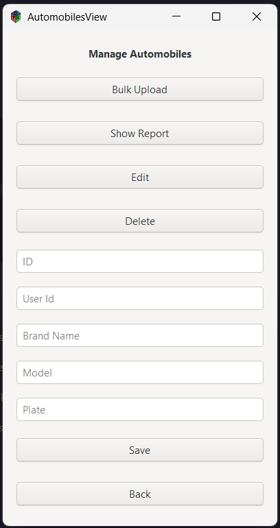
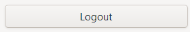
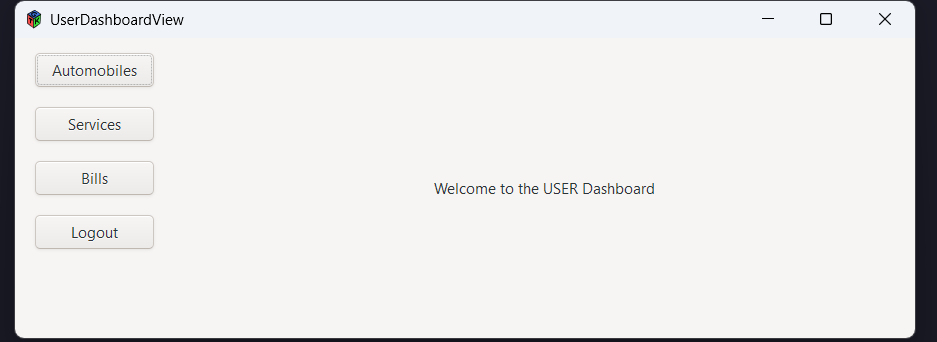

# Manual de Usuario: Taller de Auto Servicio AUTOGEST PRO

Este manual te guiará a través de las funciones básicas de la aplicación de gestión de talleres de auto servicio.

## Tabla de Contenidos
1. [Introducción](#introducción)
2. [Paso 1: Inicio de Sesión](#paso-1-inicio-de-sesión)
3. [Paso 2: Dashboard Principal](#paso-2-dashboard-principal)
4. [Paso 3: Gestión de Usuarios](#paso-3-gestión-de-usuarios)
5. [Paso 4: Gestión de Repuestos](#paso-4-gestión-de-repuestos)
6. [Paso 5: Gestión de Automóviles](#paso-5-gestión-de-automóviles)
7. [Paso 6: Gestión de Servicios](#paso-6-gestión-de-servicios)
8. [Paso 7: Gestión de Facturas](#paso-7-gestión-de-facturas)
9. [Paso 8: Reportes Importantes](#paso-8-reportes-importantes)
10. [Paso 9: Cerrar sesión](#paso-9-cerrar-sesión)
11. [Conclusión](#conclusión)

---

## Introducción
Este manual te guiará a través de las funciones básicas de la aplicación de gestión de talleres de auto servicio.

---

## Paso 1: Inicio de Sesión

1. Abre la aplicación y verás la pantalla de inicio de sesión.
2. Ingresa tu **Nombre de usuario** y **Contraseña**.
3. Haz clic en el botón **Login** para acceder.

---

## Paso 2: Dashboard Principal

1. Una vez iniciada la sesión, accederás al **Dashboard**.
2. Desde aquí puedes navegar a las diferentes secciones:
   - **Usuarios**: Gestiona los usuarios del sistema.
   - **Repuestos**: Administra los repuestos del taller.
   - **Automóviles**: Gestiona los automóviles registrados.
   - **Servicios**: Administra los servicios realizados.
   - **Facturas**: Visualiza y gestiona las facturas.
   - **Reportes**: Accede a reportes importantes.
3. Para cerrar sesión, haz clic en **Logout**.

---

## Paso 3: Gestión de Usuarios

1. En la sección **Usuarios**, puedes:
   - **Subir usuarios en masa** (Bulk Upload).
   - **Ver reportes** de usuarios.
   - **Editar** o **Eliminar** usuarios existentes.
2. Completa los campos: **ID**, **Nombre**, **Apellido**, **Email** y **Contraseña**.
3. Haz clic en **Guardar Usuario** para confirmar cambios.
4. Usa el botón **Atrás** para volver al Dashboard.

---

## Paso 4: Gestión de Repuestos

1. En la sección **Repuestos**, puedes:
   - **Subir repuestos en masa** (Bulk Upload).
   - **Ver reportes** de repuestos.
   - **Editar** o **Eliminar** repuestos existentes.
2. Completa los campos: **ID** y **Nombre del Repuesto**.
3. Haz clic en **Guardar** para confirmar cambios.
4. Usa el botón **Atrás** para volver al Dashboard.

---

## Paso 5: Gestión de Automóviles

1. En la sección **Automóviles**, puedes:
   - **Subir automóviles en masa** (Bulk Upload).
   - **Ver reportes** de automóviles.
   - **Editar** o **Eliminar** automóviles existentes.
2. Completa los campos: **ID**, **ID de Usuario**, **Marca**, **Modelo** y **Placa**.
3. Haz clic en **Guardar** para confirmar cambios.
4. Usa el botón **Atrás** para volver al Dashboard.

---

## Paso 6: Gestión de Servicios

1. En la sección **Servicios**, puedes:
   - **Ver reportes** de servicios.
   - **Editar** o **Eliminar** servicios existentes.
2. Completa los campos: **ID**, **ID de Repuesto**, **ID de Automóvil**, **Detalles** y **Costo**.
3. Haz clic en **Guardar** para confirmar cambios.
4. Usa el botón **Atrás** para volver al Dashboard.

---

## Paso 7: Gestión de Facturas

1. En la sección **Facturas**, puedes:
   - **Cancelar facturas**.
   - **Ver reportes** de facturas.
2. Visualiza los campos: **ID**, **ID de Orden** y **Costo Total**.
3. Usa el botón **Atrás** para volver al Dashboard.

---

## Paso 8: Reportes Importantes

1. En la sección **Reportes**, puedes:
   - **Ver registros de logs**.
   - **Ver los Top 5 automóviles más antiguos**.
   - **Ver los Top 5 servicios de automóviles**.
2. Estos reportes te ayudarán a tomar decisiones informadas.

---

## Paso 9: Cerrar sesión

1. En la sección **Reportes**, puedes:
   - **Salir de tu cuenta**.

---

## Conclusión
¡Felicidades! Ahora conoces las funciones básicas de la aplicación de gestión de talleres de auto servicio. Para más detalles, consulta la documentación oficial o contacta al soporte técnico.