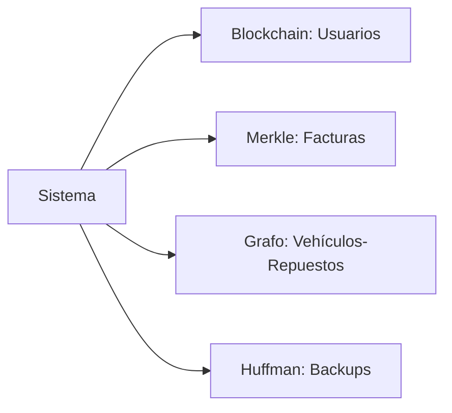
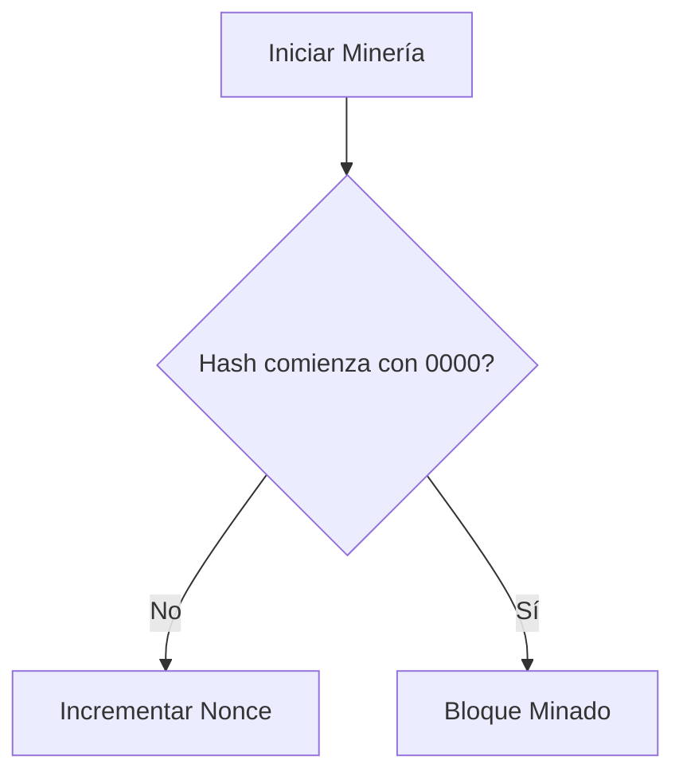
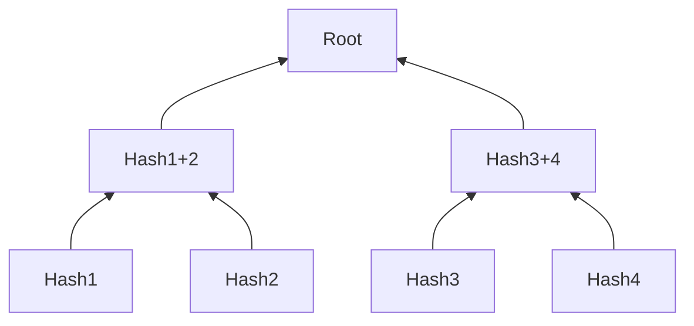
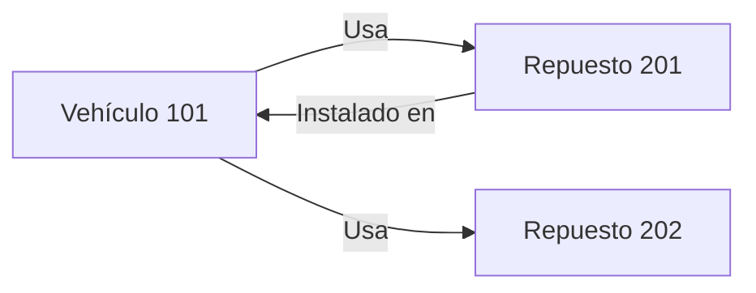
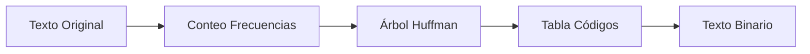
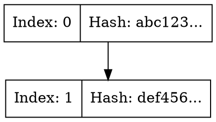
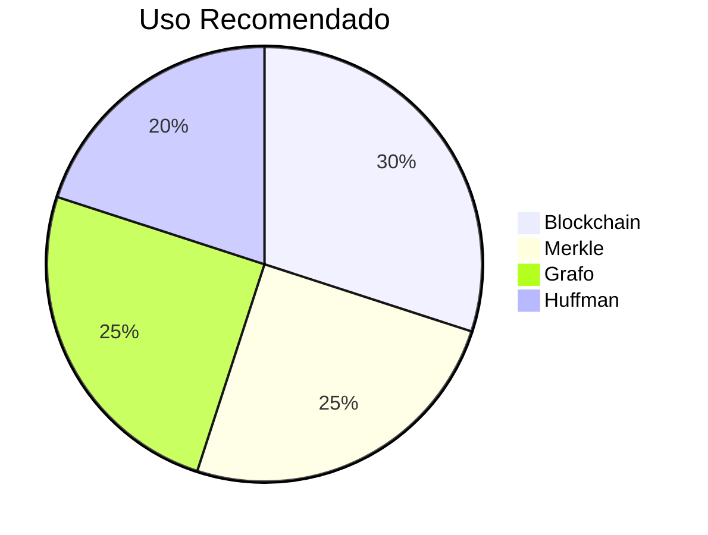

# 🌐 Manual de Desarrollador: Estructuras Avanzadas en AUTOGEST PRO

## 📋 Tabla de Contenidos
1. [Introducción](#-introducción)
2. [Blockchain para Usuarios](#-blockchain-para-usuarios)
   - [Estructura](#estructura-blockchain)
   - [Operaciones clave](#operaciones-clave-blockchain)
3. [Árbol de Merkle](#-árbol-de-merkle)
   - [Estructura](#estructura-merkle)
   - [Operaciones clave](#operaciones-clave-merkle)
4. [Grafo No Dirigido](#-grafo-no-dirigido)
   - [Estructura](#estructura-grafo)
   - [Operaciones clave](#operaciones-clave-grafo)
5. [Compresión Huffman](#-compresión-huffman)
   - [Estructura](#estructura-huffman)
   - [Operaciones clave](#operaciones-clave-huffman)
6. [Visualización](#-visualización)
7. [Benchmarking](#-benchmarking)
8. [Mejores Prácticas](#-mejores-prácticas)

---

## 🌟 Introducción
Implementación de estructuras avanzadas en C# para el sistema de gestión automotriz AUTOGEST PRO:



---

## ⛓️ Blockchain para Usuarios

### Estructura Blockchain
```csharp
public class Block {
    public int Index { get; set; }
    public string Timestamp { get; set; }
    public string Data { get; set; }  // Serializado JSON del usuario
    public int Nonce { get; set; }
    public string PreviousHash { get; set; }
    public string Hash { get; set; }
    [JsonIgnore]
    public Block Next { get; set; }
}
```

### Operaciones Clave Blockchain
| Método | Complejidad | Descripción |
|--------|------------|-------------|
| `CalculateHash()` | O(1) | Genera hash SHA-256 del bloque |
| `MineBlock()` | O(n) | Prueba de trabajo (PoW) con nonce |
| `AddBlock()` | O(n) | Añade bloque validando hash anterior |
| `ValidateCredentials()` | O(n) | Verifica usuario con hash SHA-256 |

**Flujo de Minería**:


---

## 🌿 Árbol de Merkle

### Estructura Merkle
```csharp
public class MerkleNode {
    public Bill Factura { get; set; }
    public string Hash { get; set; }
    public MerkleNode Left { get; set; }
    public MerkleNode Right { get; set; }
}
```

### Operaciones Clave Merkle
| Método | Complejidad | Descripción |
|--------|------------|-------------|
| `BuildTree()` | O(n log n) | Construye árbol desde hojas |
| `GenerateHash()` | O(1) | Combina hashes hijos |
| `GetBillsByServiceIds()` | O(n) | Búsqueda por IDs de servicio |

**Ejemplo de Construcción**:


---

## 🕸️ Grafo No Dirigido

### Estructura Grafo
```csharp
public class UnDirectedGraph {
    private Dictionary<string, List<string>> listaAdyacencia;
    // Key: ID de vehículo/repuesto
    // Value: Lista de conexiones
}
```

### Operaciones Clave Grafo
| Método | Complejidad | Descripción |
|--------|------------|-------------|
| `Insertar()` | O(1) | Añade relación bidireccional |
| `GenerarDot()` | O(V+E) | Exporta para Graphviz |

**Relación Vehículo-Repuesto**:


---

## 📦 Compresión Huffman

### Estructura Huffman
```csharp
public class HuffmanNode {
    public char Character { get; set; }
    public int Frequency { get; set; }
    public HuffmanNode Left { get; set; }
    public HuffmanNode Right { get; set; }
}
```

### Operaciones Clave Huffman
| Método | Complejidad | Descripción |
|--------|------------|-------------|
| `BuildHuffmanTree()` | O(n log n) | Construye árbol de frecuencias |
| `Compress()` | O(n) | Codifica texto con tabla Huffman |
| `Decompress()` | O(n) | Decodifica usando árbol |

**Proceso de Compresión**:


---

## 📊 Visualización
Todas las estructuras implementan:

```csharp
public string GenerateDot() {
    // Genera código DOT para Graphviz
}
```

**Ejemplo Blockchain**:


---

## ⚡ Benchmarking
| Estructura | Inserción | Búsqueda | Memoria | Caso Ideal |
|------------|----------|----------|---------|------------|
| Blockchain | O(n) | O(n) | Alta | Registros inmutables |
| Merkle | O(log n) | O(n) | Media | Verificación integridad |
| Grafo | O(1) | O(V+E) | Variable | Relaciones complejas |
| Huffman | O(n log n) | O(n) | Baja | Compresión texto |

---

## 🏆 Mejores Prácticas

**Blockchain**
```diff
+ Ideal para auditoría de usuarios
+ Inmutabilidad garantizada
- No para datos volátiles
```

**Árbol Merkle**
```diff
+ Perfecto para facturas
+ Verificación rápida de integridad
```

**Grafo No Dirigido**
```diff
+ Modela relaciones vehículo-repuesto
+ Búsqueda bidireccional
```

**Huffman**
```diff
+ Máxima compresión para backups
+ Eficiente con datos repetitivos
```

---

## 📝 Conclusión

**Criterios de Selección**:
1. **Persistencia**: Blockchain para datos críticos
2. **Integridad**: Merkle para facturas
3. **Relaciones**: Grafo para conexiones complejas
4. **Compresión**: Huffman para backups grandes