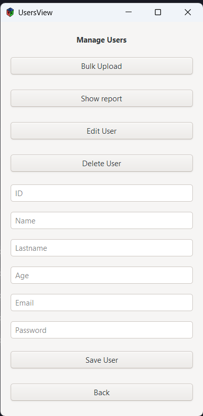
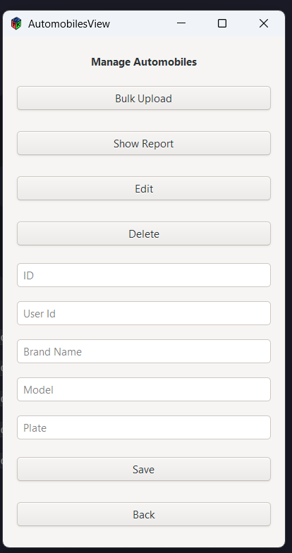
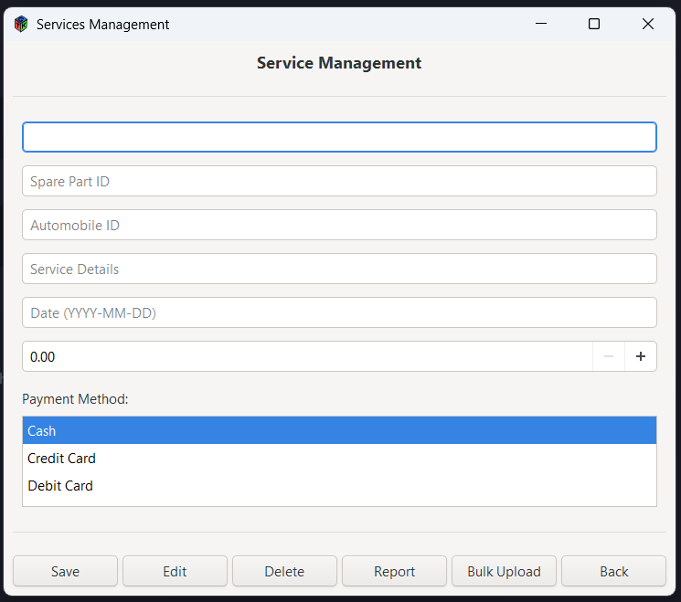
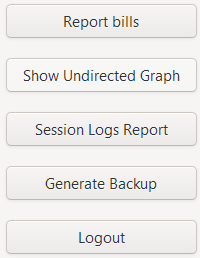

# Manual de Usuario: AUTOGEST PRO  
## Sistema de Gestión para Talleres Automotrices  

  

## Tabla de Contenidos  
1. [Introducción](#introducción)  
2. [Tipos de Usuarios](#tipos-de-usuarios)  
3. [Acceso al Sistema](#acceso-al-sistema)  
4. [Área de Administración](#área-de-administración)  
   - [Dashboard Admin](#dashboard-admin)  
   - [Gestión de Usuarios](#gestión-de-usuarios)  
   - [Gestión de Repuestos](#gestión-de-repuestos)  
   - [Gestión de Automóviles](#gestión-de-automóviles)  
   - [Gestión de Servicios](#gestión-de-servicios)  
   - [Reportes y Respaldo](#reportes-y-respaldo)  
5. [Área de Usuario](#área-de-usuario)  
   - [Dashboard Usuario](#dashboard-usuario)  
   - [Visualización de Automóviles](#visualización-de-automóviles)  
   - [Visualización de Servicios](#visualización-de-servicios)  
   - [Gestión de Facturas](#gestión-de-facturas)  
6. [Cerrar Sesión](#cerrar-sesión)  

---  

## Introducción  
AUTOGEST PRO es un sistema desarrollado por **LabEDD - Marcos Bonifasi** para la gestión integral de talleres automotrices, con dos interfaces diferenciadas:  
- **Área de Administración**: Para gestión completa del taller (inventario, usuarios, servicios y reportes).  
- **Área de Usuario**: Para que los clientes consulten sus vehículos, servicios y facturas.  

---  

## Tipos de Usuarios  
| Rol | Accesos | Email | Contraseña |  
|------|---------|-------|-------|  
| Administrador | Todas las funciones de gestión | admin@usac.com | admin123 |  
| Usuario | Consulta de vehículos, servicios y facturas | (Registrado por admin) | (Asignado por admin) |  

---  

## Acceso al Sistema  
  
1. Ingrese a la aplicación AUTOGEST PRO.  
2. Complete los campos:  
   - **Email**: Correo registrado (ej. `admin@usac.com`).  
   - **Password**: Contraseña asignada.  
3. Haga clic en **Validate**.  

> 🔒 *El sistema redirige automáticamente al dashboard según el tipo de usuario (Admin o Usuario).*  

---  

# Área de Administración  

## Dashboard Admin  
  
**Menú principal**:  
- **Users**: Gestión de cuentas de usuarios.  
- **Spare Parts**: Control de inventario de repuestos.  
- **Automobiles**: Registro de vehículos asociados a usuarios.  
- **Services**: Administración de servicios técnicos.  
- **Report bills**: Generación de facturas.  
- **Show Undirected Graph**: Visualización gráfica de relaciones entre servicios.  
- **Session Logs Report**: Reportes de accesos al sistema.  
- **Generate Backup**: Respaldo de datos.  
- **Logout**: Cerrar sesión.  

> 📌 *Bienvenida personalizada para el rol de ADMIN.*  

---  

## Gestión de Usuarios  
  
**Funciones disponibles**:  
- 📤 **Bulk Upload**: Carga masiva de usuarios mediante archivo CSV.  
- 📊 **Show report**: Generar reportes en PDF/Excel.  
- ✏️ **Edit User**: Modificar datos de usuarios existentes.  
- 🗑️ **Delete User**: Eliminar cuentas (requiere confirmación).  

**Campos obligatorios para registro**:  
- **ID**: Identificador único.  
- **Name/Lastname**: Nombre completo.  
- **Age**: Edad.  
- **Email**: Correo válido.  
- **Password**: Contraseña encriptada.  

> ⚠️ *Solo el administrador puede crear o eliminar usuarios.*  

---  

## Gestión de Repuestos  
  
**Acciones clave**:  
- 📤 **Bulk Upload**: Importar repuestos desde archivo.  
- 📊 **Show Report**: Reporte de stock y precios.  
- ✏️ **Edit**: Actualizar detalles o existencias.  

**Datos requeridos**:  
- **ID**: Código único del repuesto.  
- **Spare Part Name**: Nombre descriptivo (ej. "Filtro de aire").  
- **Details**: Especificaciones técnicas.  

---  

## Gestión de Automóviles  
  
**Funcionalidades**:  
- 🚗 **Bulk Upload**: Registrar múltiples vehículos.  
- 📋 **Show Report**: Listado completo.  
- ✏️ **Edit/Delete**: Modificar o eliminar registros.  

**Campos esenciales**:  
- **User Id**: Dueño del vehículo.  
- **Brand/Model**: Marca y modelo (ej. "Mercedes-Benz CLA 250").  
- **Plate**: Placa/licencia (ej. "ABC1D2E").  

---  

## Gestión de Servicios  
  
**Proceso de registro**:  
1. Seleccionar:  
   - **Space Part ID**: Repuestos utilizados.  
   - **Automobile ID**: Vehículo atendido.  
2. Detallar:  
   - **Service Details**: Descripción del servicio.  
   - **Date**: Fecha (formato `YYYY-MM-DD`).  
3. Definir:  
   - **Payment Method**: Efectivo, Tarjeta de Crédito/Débito.  

**Botones de acción**:  
- 💾 **Save**: Guardar servicio.  
- 📄 **Report**: Generar comprobante.  

---  

## Reportes y Respaldo  
  
**Opciones avanzadas**:  
- 📈 **Show Undirected Graph**: Visualizar relaciones entre servicios y repuestos.  
- 📑 **Session Logs Report**: Auditoría de accesos al sistema.  
- 💾 **Generate Backup**: Crear copia de seguridad de la base de datos.  

---  

# Área de Usuario  

## Dashboard Usuario  
  
**Menú limitado**:  
- 🚗 **Automobiles**: Ver vehículos registrados.  
- 🛠️ **Services**: Consultar servicios realizados.  
- 💰 **Bills**: Revisar facturas generadas.  
- 🚪 **Logout**: Cerrar sesión.  

> 👋 *Mensaje de bienvenida personalizado para el USUARIO.*  

---  

## Visualización de Automóviles  
  
**Contenido**:  
- Tabla con vehículos asociados al usuario:  
  - **ID**: Identificador.  
  - **Brand/Model**: Detalles del automóvil.  
  - **Plate**: Placa.  

**Acción**:  
- ↩️ **Back**: Volver al dashboard.  

---  

## Visualización de Servicios  
  
**Tipos de visualización**:  
- **PreOrden**: Servicios pendientes.  
- **InOrden**: Servicios en progreso.  
- **PostOrden**: Servicios completados.  

> 🔍 *Los servicios se organizan en estructuras de árbol para facilitar la navegación.*  

---  

## Gestión de Facturas  
  
**Funcionalidades**:  
- Consultar historial de facturas.  
- Filtrar por fecha o servicio.  

---  

## Cerrar Sesión  
1. En cualquier pantalla:  
   - Haga clic en **Logout** (disponible en ambos dashboards).  
   - Confirme la acción.  

> ℹ️ *La sesión se cierra automáticamente después de 30 minutos de inactividad.*  

---  

## Soporte Técnico  
Para asistencia contacte a:  
📧 soporte@labedd.com  
📞 +502 1234-5678  
🕒 Lunes a Viernes 8:00-17:00  

---  

**© 2025 LabEDD - Marcos Bonifasi**